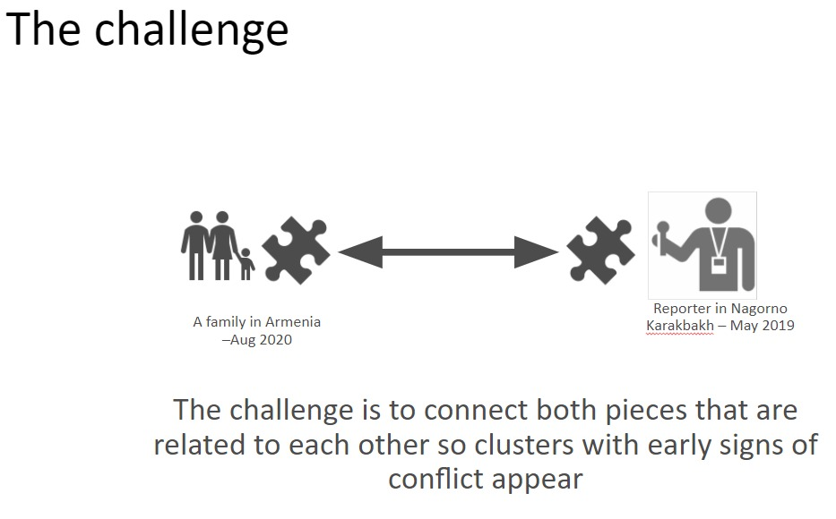
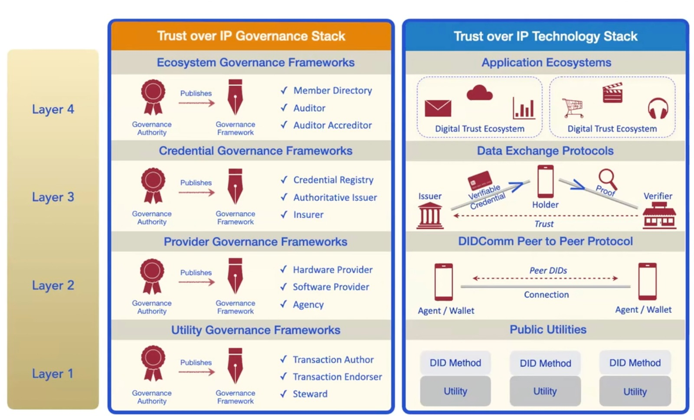

# Safe communication
...as a part of ...
### A DIGITAL ARCHITECTURE FOR PEACE

Business Plan for Peace and the Dutch Ministry of Defence invite you to help in the challenge of preventing human suffering and shifting humanity’s habit away from violent conflict towards the prevention of conflict.

**Invitation** 
Business Plan for Peace and the Dutch Ministry of Defence are inviting policy makers, NGOs working on peace, army personnel, people living in ‘conflict areas’, and many other stakeholders to work with the teams, be the first to test and give feedback to the solutions, and then help launch the best solutions after the event.

## Situation proved to be unsolveable by current means
People in hostile occupied territories need Self-Sovereign Identity in its purest form, otherwise they might die. The same holds for journalists.
These people like to work from their pseudonymity and like to be paid accordingly.

### Related developments
1. AI helps to tag data that goes hence and forth through the network, in a way that a incentive system is feasible.
2. In the value chain information goes from an informant (e.g. journalist) to a NGO/UN and crypto money in the opposite direction. NGO services the exchange to and fro Euro's/Dollars.

## Objectives of the Safe communication challenge

1. Safe communication with skin in the game for all parties involved
2. Rules set upfront can't be censored nor tampered with by any centralised power
3. Pay in BTC for information 

 

## Solution
1. Stick to the lingo W3C Trust-over-IP governance and technical stack  
 
2. Stick to the [terminologie of DIDs](https://w3c.github.io/did-core/#terminology) by the W3C

#### DID creation by holders
##### Why DIDs
DIDs have been designed so that they may be decoupled from centralized registries, identity providers, and certificate authorities. Specifically, while other parties might be used to help enable the discovery of information related to a DID, the design enables the controller of a DID to prove control over it without requiring permission from any other party. DIDs are URIs that associate a DID subject with a DID document allowing trustable interactions associated with that subject. 
(from: https://w3c.github.io/did-core/)

##### What is a DID?
A globally unique persistent identifier **that does not require a centralized registration authority** because it is generated and/or registered cryptographically.

##### Why decentralized?
Decentralized identity management **extends** authority for identifier generation, registration, and assignment beyond traditional roots of trust such as most national ID systems.

On layer 1 an open public blockchain. Because of Objective 1. That limits the range of possible product & services drastically.

[Key points of ION](https://github.com/decentralized-identity/ion#key-points) seem to match our objectives, That's good start.

The status of [BTCR]()

Layer 2 signing sessions of already established relationshps in real world.

#### DDO creation and amendments by holders
Build reputation in layer 2 DDOs (journalist writes pieces, individual has intel, photographer shoots photo)

#### Issue VCs
Obtain credentials in layer 3 from an issuer 
perhaps a VC is needed for the journalist related to the NGO. so that the journalist can check that the NGO has been 'verified' by the UN 
{TBW}

#### Grant VCs
NGO must provide a credential for a holder. In a way that the issuer can not 
1. betray the holder and 
2. issue public credentials 
Additions
1. -> I have to find out how to give a face a vc 
2. -> that is regulated in certain W3C DID implementations, I just remember not whether it is so at all imps)

{TBW}
#### Verify VCs
{TBW}

## What is the real life problem we're going to solve
UN in Switzerland works in two directions (up and down the value chain) towards Embassy-> NGO-> resistance fighter / journalist and the other side: towards Ministry-> Defense-> soldier

In order to complete the full circle, it is ultimately about the soldier being able to help the resistance fighter.

We might have to think of a situation that you could not possibly solve before without having SSI based on the W3C DID standards and open public blockchain on layer 1.